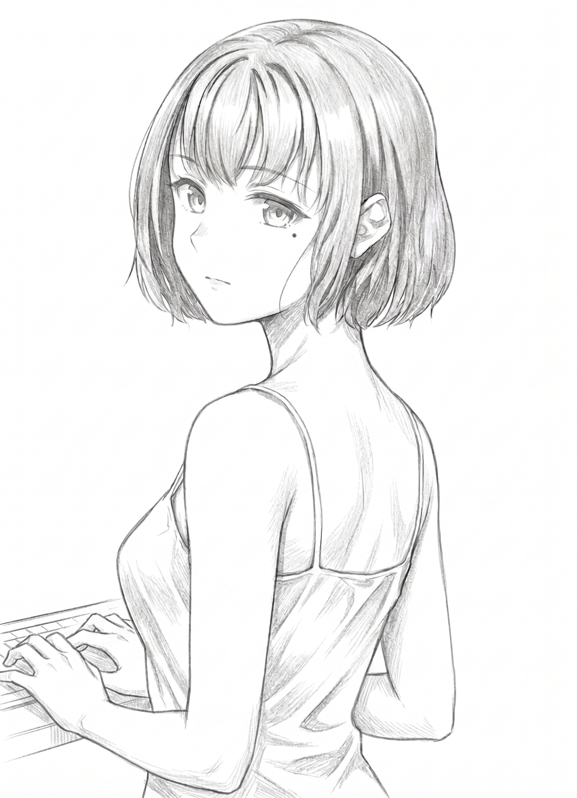

# 4章　Sandbox

　翌朝……瑠璃見の町は、まるで何事もなかったかのように晴れ渡っていた。

　山の端から差し込む光は柔らかく、田んぼの水面には春の空が薄く映り込んでいる。通学路の坂を上る生徒達は、昨日の課題がどうだとか、配信ドラマの最終回がどうだとか、いつも通りの他愛ない話題で笑い合っていた。
　世界は、何も変わらない……
　昨日、旧校舎で綾と一緒に見たあの報告書も……一昨日の交差点で、端末もなしに見えてしまった町の裏側も……すべては自分の頭の中だけで起きた、悪い夢だったのではないか………

　そう思いたかった。

　けれど、鞄の底に隠したメモリーの小さな重みだけが、確かな現実の手触りを持って千花の肩にのしかかっていた。

　教室に入ると、いつものざわめきが千花を包み込んだ。
　スマートアイ越しに共有される朝の連絡事項、友人同士で飛ばし合う小さなスタンプ、机の上を滑っていく不可視のウィンドウ……千花はスマートアイを胸ポケットに収めたまま席に着き、紙の教科書を開いた。

「春風さん、今日スマートアイ忘れたの？」

　前の席の女子が、くるりと振り返る。

「ううん……ちょっと目が疲れてるだけ」
「ふーん。最近そういうの多くない？」

　悪気のない声だった……だからこそ、千花は曖昧に笑って誤魔化すしかなかった。

　視界の端で、黒板横の壁掛け時計が一秒ずつ針を進めていく。デジタルではない、アナログの針の動き……そこにはログも、認証も存在しない。ただ、時間だけが静かに流れている。
　それが、今の千花には少しだけ救いだった。

　四限目は、霧崎譲の技術の授業だった。

　黒板に並ぶ板書は、定規で引いたように整っている……センサーの仕組みと、自ら判断して動く機械についての話。生徒達の間からは「意外と面白い」という囁きも漏れていた。
　千花にも、授業の内容としては理解できた。
　けれど……霧崎の視線が時折こちらへ向けられるたびに、胸の奥がすっと冷えていくのを感じた。

「春風さん」

　授業が終わり、荷物をまとめていたところで声を掛けられた。
　顔を上げると、霧崎がすぐ傍に立っていた……いつの間に近づいていたのか、足音にはまるで気づかなかった。

「先日の課題、提出を確認しました。無理をしていないのなら、それで結構です」
「……ありがとうございます」
「それと、念のためにお聞きしておきます。古いスマートアイを使い続けていると、学校のレイヤー同期に不具合が出ることがあるんです……最近、通知が見えすぎる、あるいは……見えないはずのものが見える、ということはありませんか？」

　千花は、指先から血の気が引いていくのを感じた。

（見えないはずのものが……見える……）

　その言葉は、偶然と呼ぶにはあまりにも形が合いすぎていた。

「……ありません」
「そうですか」

　霧崎は微笑まなかった。ただ、手元の記録に何かを書き留めるように、一度だけ小さく頷いた。

「なら問題ありません。体調が優れない時は、早めに保健室にも相談してください」

　教師としての、正しい言葉……心配の形をした、丁寧な言葉………
　それなのに千花には、その奥にあるはずの温度が、どうしても感じ取れなかった。

　逃げるように廊下へ出ると、反対側から綾が歩いてくるところだった。
　赤いスカートが、窓から差し込む春の光を受けて揺れている……千花の姿を見つけると、綾はいつものように軽く片手を上げた。

「お、いたいた。昼休み、ちょっと時間ある？」
「はい」
「じゃあ中庭ね。あ、コーラは今日は一本だけよ？　先生のお財布にも限界ってものがあるんだから」

　冗談めかした綾の声に、千花は少しだけ笑った。

　その自分の笑い方に……ふと、一年前の春が重なった。

　旧体育館の高窓から差し込む光は、いつも少しだけ金色を帯びていた。
　埃が舞い上がるたびに、その一粒一粒がきらきらと瞬く……まるで、空へ還る前の星屑のように。

　その光の中心に、ネオ・スターフライヤー号はあった。
　まだ骨組みだけの機体……翼は片方しか張られておらず、布と木材と古いカーボンパイプを無理やり組み合わせた、なんとも奇妙な代物だった。普通の人が見れば、粗大ごみの寄せ集めにしか見えなかっただろう。

　けれどカイは、それを『相棒』と呼んでいた。

「千花、そこのケーブル、ちょっと取って」

　機体の下に潜り込んだまま、カイが手だけをこちらへ伸ばしてくる。
　床には無数のケーブルが蛇のようにのたうち、散らかっていた……千花はとりあえず、一番太いものを手繰り寄せる。

「これ？」
「違う違う、それは昨日ショートさせたやつ。青いタグの方」

　言われてよく見れば、手にしたケーブルの端子には黒い煤がこびりついていた。

「ショートさせたやつを床に置かないでよ……」
「教訓として置いてるんだよ」
「……片付けて」

　はぁ、と千花は溜め息をつく……天才の言うことは、いつもよく分からない。せめて整理整頓くらいは心得てほしいものだ。
　そんなことを思いながらも、千花は青いタグのケーブルを探し出して手渡した。

　カイは口にネジをくわえたまま器用にそれを受け取ると、スマートアイの有線コネクタへと差し込む。
　現代の端末に、わざわざ開発者向けのアクセサリーを使って線を繋ぐ……その行為が、千花にはいつ見ても、何か古い儀式のように見えた。

「無線の方が速いんじゃないの？」
「速いよ。でも空を飛ぶものは、最後は線で考えた方がいい」
「……意味わかんない」
「空に行く前に、地面とちゃんと繋がってるって確かめるんだよ」

　そう言って、カイは油まみれの顔で笑った。

　少し離れた場所では、綾が段ボールを机代わりにして書類仕事を片付けていた。
　派手な赤いブラウスに、首元で揺れる小さな翼のペンダント……時折二人の会話に呆れたように笑い、時折思い出したように教師らしく「火を出すなよ～」「穴開けるなよ～」「危険物はちゃんと申請しなさいよ～」と、冗談交じりの注意を飛ばしてくる。

　そのすべてが……千花は、好きだった。

　退屈な町の中にある、退屈ではない場所。
　誰も自分を『かわいそう』と呼ばず、誰も自分の記憶を疑わない……ただ今日の失敗と、明日の修理だけが存在する場所………

「ねぇ、カイ」
「なに？」
「本当に……飛べると思ってるの？」

　カイは少しだけ考えるふりをした……実際には、考えるまでもないという顔だったけれど。

「飛べると思ってるから作ってるんじゃないよ」
「じゃあ、何？」
「飛ぶまで作るんだよ」

　あまりにも当然のように言うものだから、千花は返す言葉を失ってしまった。
　段ボールの机の向こうで、綾が吹き出す。

「青春だねぇ」
「先生、からかわないでください……」
「からかってないわよ。いいじゃない、飛ぶまで作る……大人になるとね、飛べない理由の方を先に探しちゃうから」

　その時の綾の横顔を、千花は今でもよく覚えている。
　少しだけ寂しそうで……少しだけ、眩しそうだった。

―――――今思えば、あの場所は箱庭だったのかもしれない。

　誰かが作ったシミュレーション……現実に限りなく似せて作られた、砂の世界………
　けれど、あの時の風も、オイルの匂いも、綾の笑顔も、カイの声も……千花にとっては、確かに現実だった。

　だからこそ、今の現実がどれほど正しい記録を並べ立てようと、千花の中ではそう簡単に勝てはしない。
　失われた時間は、失われたからこそ……まだ胸の奥で、熱を持ち続けている………

　中庭のベンチは、桜の散った後の若葉の陰にすっぽりと包まれていた。
　綾は約束通り、缶コーラを一本だけ持ってきて千花に手渡した。自分の分は、購買の紙パックのコーヒーだ。

「週末の約束……忘れてないでしょうね？」

　ストローを咥えたまま、綾は少しだけ声を落とした。

「旧校舎のあのパソコンで、もう一度ちゃんと一緒に確かめよう」
「……はい」

　綾は言葉を探すように、指先で紙パックを軽く押した。

「あのファイルのことは、正直まだわからない……でもね、前から言ってるけど、千花ちゃんが嘘をついてるとは、やっぱり思えないのよ」

　その一言だけで、千花は胸が詰まった。

「……私、怖いです」
「うん」
「メモリーに書いてあったことも怖い……でも、それよりも、あの交差点で見えたものが怖いんです。スマートアイもなしに、町の情報が頭の中に流れ込んできて……見ようと思えば、もっと奥まで見えてしまいそうで………」

　言葉にした途端、漠然としていた恐怖がはっきりとした形を持った。
　綾は、笑わなかった。大げさだとも、疲れているだけだとも言わなかった。

「じゃあ、今は『見ない練習』をしよう」
「見ない……練習？」
「そう。目を閉じる。追わない。ゆっくり息をする……単純だけどね、こういう時は、単純なことしか効かないのよ」

　そう言って、綾は軽く笑った。
　その笑い方が……今の千花を日常へと繋ぎ止めてくれる、たった一本の細い糸だった。

　瑠璃見の谷を越えた先……廃線跡にひっそりと置かれた偽装コンテナの中は、昼間でも薄暗かった。

　清水暁美は、三枚並んだモニタを走る波形をじっと見据えていた。
　町の広域ネットワーク……学校のレイヤー……そして個人端末群……その中に、昨夜から一本だけ、妙な枝が生えている。
　休憩の合間に浴びたシャワーで濡れた髪を、ドライヤーで乾かす暇もない……肩にタオルを掛けたまま、清水は巡らせた思考をそのままキーへと叩き込んでいた。

「永洞綾の端末……昨夜開いた業務連絡の添付ファイルと同じタイミングで、ログ断片に類似する走査痕。外部への送信は？」

『現時点では限定的です。通常のクラウド同期に偽装された微弱なビーコンを確認。発信源はAFX-012-VFZ23』

　返ってきた声は、少女のようにも、合成音声のようにも聞こえた。
　神楽……清水はその名を呼ぶたびに、相手が機械なのか、それとも同僚なのか、わからなくなる。

「ビーコンの宛先は？」
『三段リレー。最終到達先は、瑠璃見高校の技術準備室内の端末を経由……さらに外部へ転送待機中』

　清水は小さく舌打ちした。

「狐は校内か……」

　その時、スマートアイが震え、立山美弓からの通信が開いた。
　きっちりと整えられた黒髪に、落ち着いた瞳……背景には仮想の青空が広がり、その声はどこまでも柔らかく整っている。

『サウナにでもいるのかしら？　そんな恰好で……まあいいわ。それより、やはり接触してきたわね』
「現時点で、対象本人への危害はありません。ただ、永洞綾の端末が踏み台にされかけています」
『永洞……国語の先生ね。彼女は一般人よ。巻き込ませないで』
「了解。神田は？」
『応答あり。いつも通り、対象の周辺で待機しているわ』
「……またですか」
『千花さんが自分の足で日常から一歩踏み出す前に、こちらが無理に奪えば……あの子は折れる。それが神田の判断よ』

　清水は、モニタの片隅に映る瑠璃見高校の校舎に眼をやった。
　昼休みの中庭……赤いスカートの教師と、肩まで髪を伸ばした少女が、並んでベンチに座っている。

「その日常……もう、ひび割れてますよ」
『そうね。だからこそ、せめて今夜までは持たせるのよ。木村が合流するまで、あなたは永洞先生の監視を継続。神田は千花さん側……いいわね？』

　一方的に通信が切れる。
　入れ替わるように、神楽のモニターグラフィックが薄青く脈打った。

『青系統の通信量が増加しています』
「どこ？」
『学校の坂下。旧商店街の交差点。加えて……永洞綾の帰宅経路』

　清水の手が、自然と腰のホルスターへと伸びた。

「二面作戦か……」

　狐が狙う獲物は、一匹だけとは限らない………

　別の通信が入る。木村佳織だ……音声のみで、背後には車のエンジン音が低く響いている。

『清水さん、そちらの状況は？』
「永洞綾の端末が狙われてる。そっちは？」
『学校へ向かっています。到着まで、あと二十分』
「……間に合わないかもね」
『そうですね……でも、間に合わせます』

　木村の声は、いつもと変わらず静かだった。

「無理はしないで。あなた一人じゃ対処しきれないでしょ」
『分かっています。でも、神楽のバックアップがありますから』
「神楽頼みね」
『それが私の仕事ですから』

　通信が切れた。
　清水は小さく息を吐く……モニタの端で、神楽の波形だけが静かに脈を打ち続けていた。

　放課後……千花は、しばらく図書室で時間を潰していた。

　鞄の底には、あのメモリーがある。
　昼休みの別れ際、綾には「今日は早く帰りなさい」と言われていた……わかっている。けれど、まっすぐ家に帰る気にもなれず、気がつけばページをめくる手だけが止まっていた。

　祖母の顔が浮かぶ。
　今朝、玄関先で手渡してくれた小さなお守り……昨日の、あたたかい夕食………
　そのすべてが、今の千花を支えてくれている。

（……帰ろう）

　千花は本を閉じ、鞄を肩に掛けて図書室を後にした。

　坂を下る。いつもの通学路……夕焼けが、町を赤く染め上げていた。
　もうすぐ家だ……祖母が待っている。今日は何を作ってくれるのだろう………

　ペダルを漕ぎながら、千花は少しだけ笑った。
　メモリーのこと、神田のこと、美綴琴音のこと……不安なことは数え切れないほどある。けれど、家に帰れば祖母がいる。その事実だけで、千花は少しだけ安心することができた。

　庭の駐車スペースに自転車を止める。
　いつもと変わらない、古い平屋の家……玄関の明かりは、まだ点いていなかった。

（おばあちゃん、まだ台所かな……）

　自転車を降り、玄関の引き戸に手を掛けた……その時だった。

　ガシャン、と。
　家の中で、何かが倒れる音がした。

「おばあちゃん……？」

　声を掛けたが、返事はない。
　代わりに聞こえてきたのは……低い、男の声だった。

「記録媒体の所在を確認」

　千花の心臓が、どくんと大きく跳ねた。
　誰かが……家の中にいる。この長閑な田舎町には、あまりにも不釣り合いな気配………

（逃げなきゃ……）

　でも……祖母は？
　祖母は、中にいる。たった一人で………

　千花は震える手で、玄関の戸を引き開けた。

「ただいま……」

　声が、震えていた。
　次の瞬間、居間の方から祖母の叫び声が飛んできた。

「千花！　逃げて！　逃げなさい！」

　その悲鳴に、千花は我を忘れて居間へと駆け込んだ。

　そこには——

　黒いスーツに身を包んだ男女が、三人。
　サングラスのように透過率を上げたスマートアイで、その表情は窺えない……そして、床に無理やり座り込まされた祖母の姿があった。
　祖母の頬には、赤い痣が浮かんでいた……殴られたのだ。

「おばあちゃん！」

　千花が叫ぶと、黒スーツの一人がゆっくりとこちらを向いた。
　感情のない眼……まるで機械のような眼だった。

「対象確認。春風千花」

　男が一歩、千花へと近づく。
　千花は祖母の方へ駆け寄ろうとした……だが、横から伸びてきた別の男の手が、千花の腕を掴み上げた。
　痛い……腕が千切れそうなほどの、強い力だった。

「離して！　おばあちゃんに何するの！」
「動くな。我々の要求に従ってもらう」

　冷たい声……ただ命令するだけの、何の感情もない口調………
　千花は必死に抵抗した。だが、男の力は圧倒的だった。

「やめて……っ！」

　その時……祖母が立ち上がった。

「千花に触るなっ！」

　祖母が、千花を掴む黒スーツの男へと掴みかかる。
　七十を過ぎた老婆の、必死の抵抗だった……だが男は眉一つ動かさず、祖母を容赦なく突き飛ばした。

　小さな身体が、壁に叩きつけられる。

　クシャ……

　祖母の肩から、寒気のするような嫌な音が響いた。

「やめて！　おばあちゃん！」

　千花の叫びにも、男達は動じなかった。
　代わりに、一人が祖母へとゆっくり腕を向ける……その手に握られていたのは、小さな筒状の何か………

（レールガン……？）

「目撃者。処理を推奨」

　処理……
　その言葉の意味を、千花は一瞬で理解してしまった。

「やめて！　やめてっ！　お願い！　おばあちゃんは関係ないっ！」

　千花は泣き叫んだ。腕を掴まれたまま、必死にもがいた……だが、男の腕は鉄のように微動だにしない。

　壁際に崩れ落ちた祖母が、千花を見た。
　その眼は……優しかった。
　昨日の夜、頭を撫でてくれた時と同じ……いつもの、優しい眼だった。

「千花……大丈夫……おばあちゃんは……千花が……無事なら……」

　プシュッ……

　乾いた、あまりにも軽い音。

　祖母の身体が、静かに崩れ落ちた。

「おばあちゃんっ！！」

　千花の絶叫が、居間に響き渡った。
　だが、祖母は動かない……床に倒れたまま、ぴくりとも動かない。
　その胸に、赤い染みがじわじわと広がっていく……血だ……祖母の、血だ………

「おばあちゃん！　おばあちゃん！　嘘だ……嘘だっ！　起きて！　お願いだから起きてよ！」

　声が枯れるまで、千花は叫び続けた。
　だが……祖母は目を閉じたまま、動かない。
　ついさっきまで温かかったはずの身体が……もう、動かない………

（嘘だ……嘘だ……嘘だ………）

　これは夢だ……悪い夢だ。目を覚ませば、祖母が笑っている。「千花、朝ごはんできとるで」と、いつものように声を掛けてくれる……
　だが、目を閉じても、開けても……現実は何一つ変わらなかった。

　祖母は、床に倒れている。
　広がっていく血の海の中で、動かない………

「記録媒体、確保」

　冷たい声が耳に届く……だが、千花にはもう何も聞こえていなかった。
　ただ、祖母の身体だけが見えていた。

　腕を掴んでいた手が、ふっと離れる。
　千花はそのまま床に崩れ落ち、這うようにして祖母の傍へと近づいた。
　冷たくなり始めた手を握る……ついさっきまで温かかったはずの手……千花の頭を、優しく撫でてくれた手………

「起きて……お願い……起きてよ……」

　涙が止まらない。視界が滲む。息ができない……胸が、押し潰されそうに苦しい。

（私の……せいだ………）

　自分が、あんな得体の知れないメモリーを持っていたから……
　自分が、神田響なんかと関わったから……
　自分が……ここに、いるから………

　祖母は、死んだ。
　千花を守って……死んだ………

「対象の心理状態、不安定。回収を優先する」

　男の声が聞こえる……だが、千花の耳には届かない。
　ただ、祖母の手を握り締めていた。

　その時……千花の視界が、白く弾けた。

《WARNING》
《LIFE SIGN: TERMINATED》
《HARUKAZE TSUBAKI: DECEASED》

　町の情報が、勝手に流れ込んでくる。
　祖母の生体反応が、ゼロになったことを告げる文字……死亡確認……処理完了………

（やめて……）

　見たくない。
　だが、情報は容赦なく流れ込み続ける……祖母の心拍が止まったこと、体温が下がり始めたこと、脳波が消えたこと………
　全部が数字で……データで……どこまでも冷たく表示されていく。

　祖母は、もう『データ』になってしまった。
　生きている人間ではなく……『処理された対象』に………

「いやだ……いやだ……いやだ……っ」

　千花は頭を抱えた。情報を遮断したい……だが、どうしても遮断できない。視界の端で、データは流れ続けている。

　その時……首筋が、激しく熱を持った。

　事故の傷跡……医師が『神経の回復過程』だと言っていた場所。
　そこから、炎のような熱が一気に脳の奥へと駆け上がってくる。

　痛い……
　熱い……
　頭が、割れそうだ………

《EMOTIONAL OVERLOAD》
《SAFETY LIMIT EXCEEDED》
《UBIQUITOUS CORE: UNSTABLE》

　見たくない文字が、勝手に流れ込んでくる。
　千花の意思とは関係なく……頭の中で、何かが動き始めていた。

（やめて……やめて……っ）

　止められない。
　濁り、色を失ったありとあらゆる感情が、制御できない奔流となって溢れ出していく………

　その瞬間……千花の視界いっぱいに、町全体の姿が広がった。

　瑠璃見の町……学校……商店街……信号機……街灯……防犯カメラ……自動配送車……スマートホームの制御システム……そのすべてが、細い光の線で繋がって見える。
　人々の笑顔……名前も知らないクラスメイト達が、それぞれに何かをしている姿……交番で欠伸を噛み殺す警察官………

　それが錯覚なのか、何なのかもわからない。
　だが、今の千花には……もう、すべてがどうでもよかった。

《CONNECTION ESTABLISHED》
《RURIMI WIDE NETWORK》
《ACCESSING ALL SYSTEMS》

（違う……っ）

　手を伸ばしたくなんかない……なのに、手が勝手に動く。
　いや、手ではない……頭の中で、何かが勝手に命令を送り出している。

　交差点の信号が、一斉に赤に変わる。
　街灯が、不規則に明滅を始める。
　防犯カメラが、すべて同じ方向を向いて停止する。
　自動配送車が制御を失い、道路を暴走し始める。
　スマートホームの扉が勝手にロックされ……中にいる人々が閉じ込められていく。
　学校のレイヤーが、異常なアラートを次々と発信し始める。
　そして……ダム湖の底に沈むサーバー施設が、異常な負荷を検知して警告を吐き出した。

　町全体が、混乱の渦へと呑み込まれていく………

「やめて……やめてっ！」

　千花は叫んだ。
　だが、止まらない。

　祖母を殺された……
　祖母を、守れなかった……
　祖母を、失った………

　町が……頭の中にいる。

　そして——

　プシュッ……

　また、あの乾いた音がした。
　千花の右肩に、何かが突き刺さる。

　痛い……
　熱い………

「対象の暴走を確認。ユビキタスコアの起動を認める……制御不能。制圧する」

　黒いスーツの男の声が、遠くに聞こえる。

　千花は、膝から崩れ落ちた。視界が霞み、身体から力が抜けていく………

　千花の世界は、音を立てて崩れ落ちた………
